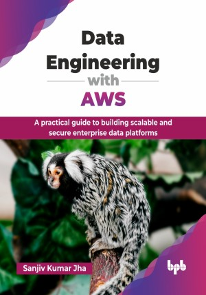

# Data Engineering with AWS

A practical guide to building scalable and secure enterprise data platforms.

This is the repository for [Data Engineering with AWS
](https://bpbonline.com/products/data-engineering-with-aws?_pos=1&_sid=6f282597c&_ss=r&variant=44748496175304?variant=44748496175304),published by BPB Publications.

## About the Book
Data engineering and AWS form the backbone of modern enterprise data architecture, enabling organizations to harness the exponential growth of data for competitive advantage. As businesses generate petabytes of information daily, the ability to build scalable, secure, and cost-effective data platforms has become critical for survival in today's data-driven economy.

This comprehensive guide takes you through the complete journey of building enterprise-grade data platforms on AWS. You will understand data lake foundations with S3, implement real-time streaming with Kinesis, and optimize batch processing using Glue. The book covers advanced topics, including data warehouse engineering with Redshift, modern architectural patterns like data mesh, and cross-boundary data sharing strategies. The guide explores the GenAI revolution transforming data platforms from human-centric to AI-native systems, covering enhanced medallion architectures that serve both traditional analytics and generative AI workloads. 

By the end of this book, you will be able to design and build scalable, secure, and cost-effective data platforms on AWS. You will master the skills to process massive datasets, implement enterprise-grade security, and architect solutions for real-time analytics and ML workflows, ultimately driving significant business value.

## What You Will Learn
• Build petabyte-scale data lakes using S3 and Lake Formation.

• Implement real-time streaming pipelines with Kinesis and Lambda.

• Design cost-optimized data warehouses using Amazon Redshift.

• Create modern data mesh architectures on AWS.

• Master DataOps practices with CI/CD and IaC.

• Architect GenAI-native platforms with enhanced medallion architectures.

• Integrate ML pipelines using SageMaker and Glue.

• Implement enterprise security and governance strategies.
